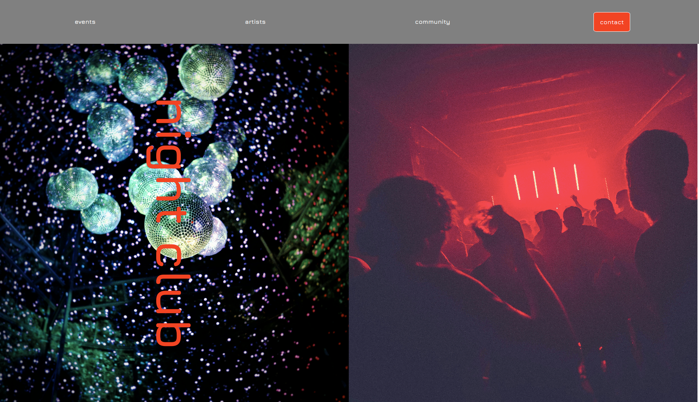
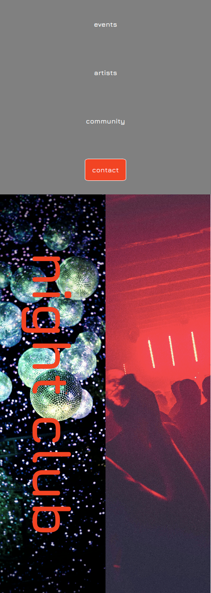

# Night Club Landingpage - simple flexbox-styling

## Exercise Course-Module 1 - UserInterfaceBasics (UIB) - HTML/CSS

created at 25.09.22;

Recreated the reference image below, using flexbox, inkl _Jura_ font from **Google Fonts** for the entire page;

#### My desktop version:

#### My mobile version:

#### Mockup/Reference image

#### Image-Sources:

background-image: Photo by <a href="https://unsplash.com/@fifernando?utm_content=creditCopyText&utm_medium=referral&utm_source=unsplash">Fidel Fernando</a> on <a href="https://unsplash.com/photos/lighted-hanging-disco-mirror-balls-249DzAuJTqQ?utm_content=creditCopyText&utm_medium=referral&utm_source=unsplash">Unsplash</a>
main-image: Photo by <a href="https://unsplash.com/@pimmyten?utm_content=creditCopyText&utm_medium=referral&utm_source=unsplash">Pim Myten</a> on <a href="https://unsplash.com/photos/people-partying-inside-room-m41k1lTzjVM?utm_content=creditCopyText&utm_medium=referral&utm_source=unsplash">Unsplash</a>
